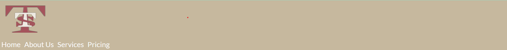

# Tuatha Transport Services

Tuatha Transport Services is a fictional art transportation company. The website allows the user to browse the available services and request a quote for selected services.

The site can be accessed [here](https://endamagennis.github.io/tuatha_transport/)

---
## Background to Tuatha

The inspiration to create a website based on this industry comes from personal experience. My father founded and owned a leading art transportation company before retirement,
giving me a unique insight into the inner workings of such a company. Tuatha is a slightly more corporate, and expansive version of the former family business. As a Galway-based company,
the logo bares the Galway colours of maroon and white. The name Tuatha, which translates to 'tribe', is also a refernce to Galway being the 'City of Tribes'.

---
## User Stories

* As a user, I want a clean and clear interface to easily navigate through the site
* As a user, I want a site which is polished so that I can be confident in the company's level of competence
* As a user, I want to understand the services and tranportation options available to me so that I can make an informed decision whether to use this company
* As a user, I want to be assured of quality and experience so that I can be certain of the safety of my artworks
* As a user, I want to be able to select from a variety of services and get an estimate of the cost for the work
* As a user, I want to establish a line of contact with the company should I require more specific services

## Features

+ ### Navbar
    - At the top of each page

    - Contains a clickable logo 

    - Contains navigation links for Home, About Us, Services, and Pricing
    
    
    
    - Links have a hover effect
    
    
    
--- 
+ ### Home Page

    - Contains a hero image, welcome message and company motto
    
    - Link to pricing page
    
    - Blurb about the foundation of the company
    
    - Image highlighting the origins of the company
    
    - Blurb discussing how the company has grown

The goal is to incorporate the personal journey of the founder in order to highlight the personal touch each job is given.

    
--- 
+ ### About Us Page

    - Contains a hero image, Meet the team message and Howard Schultz Quote
    
    - Link to pricing page
    
    - Images of each team member and their positions in the company

The goal is to inject personality and a sense of connection to the company

    
---
+ ### Services Page
 
    - Maintains style consistencey with hero image, Services heading, and another company motto
    
    - Link to pricing page
    
    - Sections of headings, descriptions of services, cost considerations, and accompanying images

The goal is to give a clear and concise breakdown of the services provided and how costs are calculated

    
---
+ ### Pricing Page

    - Background image matching the homepage hero image for style consistency
    
    - Form used to get a quote via email:
        
        * Includes text input
        * Includes email input
        * Includes number input
        * Includes checkbox input
        * Includes radio input
        * Includes textarea
        * Includes submit input   

The goal is to alow the user to make tailored requests for jobs and recieve email feedback in a timely manner

--- 
+ ### Footer

    - Each page has a footer which contains social media links which open in a new tab
    

--- 
+ ### Thank you page

    - After form submission, the user is redirected to a thank you page
    - The page automatically returns the user to the homepage after 5 seconds

--- 
## Technologies Used

- [HTML](https://developer.mozilla.org/en-US/docs/Web/HTML) was the foundation of the site architecture.
- [CSS](https://developer.mozilla.org/en-US/docs/Web/css) was used for styling the HTML elements.
- [CSS Flexbox](https://developer.mozilla.org/en-US/docs/Learn/CSS/CSS_layout/Flexbox) was used for responsive design on each page.
- [CSS Grid](https://developer.mozilla.org/en-US/docs/Web/CSS/grid) was used partially for the services page layout.
- [Balsamiq](https://balsamiq.com/) was used to make wireframes for the website.
- [Codeanywhere](https://app.codeanywhere.com/) was used as the primary code editor.
- [Git](https://git-scm.com/) was used for the version control of the website.
- [GitHub](https://github.com/) was used to host the code and deploy the sight.
- [GIMP](https://www.gimp.org/) was used to create the logo for Tuatha.
- [COOLERS](https://coolors.co/) was used to generate color pallletes.
- [Stack Overflow](https://stackoverflow.com/) was used for some troubleshooting and implementation.
- [Pexels](https://www.pexels.com/) was used to source many of the images.
- [Google Images](https://www.google.com/imghp?hl=EN) was used to source some of the images.
- [Lightworks](https://lwks.com/) was used to edit videos.
- [Microsost Clipchamp](https://app.clipchamp.com/login) was used to create GIFs.

--- 
## Design

### Colour Scheme

- Muted color pallette with soft pastels to create a visual sense of calm and composure, replicating an art gallery
- Allows the imagery and text to stand out

### Typogrphy

- Jost font from Goolge was the main font used throughout the site, it is a sans serif font with high readability with a touch of styling

- Lato was the original base font, but after testing, it became the fallback

- Merriweather is another Google API font, it is a high readablity serif font and was used to highlight workers names and positions

---
### Wireframes

#### Mobile devices

- [Home Page. Mobile Screen](documentation/wireframes/index_wireframe_350px.png)
- [About Us Page. Mobile Screen](documentation/wireframes/meet_the_team_wireframe_350px.png)
- [Services Page. Mobile Screen](documentation/wireframes/services_wireframe_350px.png)
- [Pricing Page. Mobile Screen](documentation/wireframes/get_a_quote_wireframe_350px.png)

#### Tablets

- [Home Page. Tablet Screen](documentation/wireframes/index_wireframe_900px.png)
- [About Us Page. Tablet Screen](documentation/wireframes/meet_the_team_wireframe_900px.png)
- [Services Page. Tablet Screen](documentation/wireframes/services_wireframe_900px.png)
- [Pricing Page. Tablet Screen](documentation/wireframes/get_a_quote_wireframe_900px.png)

#### Desktop

- [Home Page. Desktop Screen](documentation/wireframes/index_wireframe.png)
- [About Us Page. Desktop Screen](documentation/wireframes/meet_the_team_wireframe.png)
- [Services Page. Desktop Screen](documentation/wireframes/services_wireframe.png)
- [Pricing Page. Desktop Screen](documentation/wireframes/get_a_quote_wireframe.png)

--- 
## Testing
+ ### Responsive Design
This site was tested using Chrome, Edge and Firefox Developer Tools.
Responsivity was maintained across all three web browsers.

### Chrome

### Edge

### Firfox

+ ### Manual Testing

| Feature | Action | Expectation | Pass | Comment |
| --- | --- | --- | --- | --- |
| Navbar | | | | |
| Logo | Click | Direct user to homepage | Yes | |
| Home | Click on 'Home' link | Direct user to homepage | Yes | |
| About Us | Click on 'About Us' link | Direct user to about us page | Yes | |
| Services | Click on 'Services' link | Direct user to services page | Yes | |
| Pricing | Click on 'Pricing' link | Direct user to pricing page | Yes | |
| Footer | | | | |
| Facebook Icon in Footer | Click on Facebook icon | Opens a new tab to Facebook | Yes | |
| Twitter Icon in Footer | Click on Twitter icon | Opens a new tab to Twitter | Yes | |
| Instagram Icon in Footer | Click on Instagram icon | Opens a new tab to Instagram | Yes | |
| Youtube Icon in Footer | Click on Youtube icon | Opens a new tab to Youtube | Yes | |
| Home Page | | | | |
| Get a Quote | Click on 'Get a Quote' button | Direct user to pricing page | Yes | |
| About Us Page | | | | |
| Get a Quote | Click on 'Get a Quote' button | Direct user to pricing page | Yes | |
| Services Page | | | | |
| Get a Quote | Click on 'Get a Quote' button | Direct user to pricing page | Yes | |
| Pricing Page | | | | |
| Name Input | User inputs string of characters | Characters are correctly displayed | Yes | |
| | User submits leaving this field blank | User is prompted to enter a string value | Yes | |
| Email Input | User inputs string of characters and '@' symbol | Characters and '@' are correctly displayed | Yes | |
| | User submits leaving this field blank | User is prompted to enter a string value | Yes | |
| | User submits string of characters but no '@' symbol | User is prompted to add correct email address | Yes | |
| Phone Input | User inputs string of numbers | Numbers are correctly displayed | Yes | |
| | User attemps to input characer string | User is prevented from doing so | Yes | |
| | User submits leaving this field blank | Form submits provided other required fields are input correctly | Yes | |
| Required Services Checkbox Input | User clicks one or multiple service checkboxes | Corresponding box is checked | Yes | |
| Number of Pieces Radio Input | User clicks on relevant radio input | Corresponding radio input is selected | Yes | |
| | User clicks a different radio input under this heading | Former selection is deselected and new input is selected | Yes | |
| Turn Around Time Radio Input | User clicks on relevant radio input | Corresponding radio input is selected | Yes | |
| | User clicks a different radio input under this heading | Former selection is deselected and new input is selected | Yes | |
| Textarea Input | User inputs strings of characters and numbers as required | Inputs are displayed correctly | Yes | |
| | User attempts to submit leaving this field blank | User is prompted to input this field | Yes | |
| | User attempts to resize the textarea with click and drag | Resize is constrained to vertical only and there is a minimum height | Yes | |
| Submit Input | User clicks the submit, having filled our required fields correctly | User is redirected to thank you page | Yes | | 
| | | User clicks the submit, not having filled our required fields correctly | User is prompted to fill out corresponding field | Yes | |
| Thank You Page | User clicks on any link | User is redirected to corresponding page | Yes | |
| | User does not click on any link for seven seconds | User is redirected to Home page | Yes | |

---
+ ### Bugs
- Page didn't fully fit browser window. Solution: set global margin to 0.
- Images consistently overlapped with other elements and broke their contraints. Solution: used [object-fit](https://www.w3schools.com/css/css3_object-fit.asp) property.
- 'Get a Quote' button highlighting glitch. Solution: make an <a> element and style it as a button, rather than using a button element containing and <a> element.
- Textarea resize broke responsive design. Solution: set min-height and constrain resize property to vertical only.
- Image scale for services.html was completely broken in Firefox. Solution: target the 
 element in the row class and set its width to 50%.

- 
    
---
## Validator testing
+ ### [HTML Validator](https://validator.w3.org/)
    
    #### Home Page

    

    #### About Us Page

      

    #### Services Page

    

    #### Pricing Page

    

    ### Thank You Page

    
        
+ ### [CSS Validator](https://jigsaw.w3.org/css-validator/)
    
    #### CSS
    
  
+ ### Accessibility and performance 
    Using [Lighthouse](https://chrome.google.com/webstore/detail/lighthouse/blipmdconlkpinefehnmjammfjpmpbjk?gclid=CjwKCAjwyeujBhA5EiwA5WD7_StwU10jzkViA3oaRKF6qgqXOb5OYcu-fmGcBHNlfklhI1H2dHKP4RoCMDsQAvD_BwE) I tested the accessiblity, and performance of each page.
    - Home Page
    
    - About Us Page
    
    - Services Page
    
    - Pricing Page
    
    - Thank You Page
    
---
## Deployment
- This site was deployed using Github Pages
- A repository was created on Github from the [Code Institute Full Template](https://github.com/Code-Institute-Org/ci-full-template)
    
- The repository url was copied and input as a workspace in [Codeanywhere](https://app.codeanywhere.com/)
    
    
    
- The HTML and CSS were edited in the workspace
- Using the built-in terminal, changes were git added, git committed, and git pushed to the main branch of the Github repository
    
- From the main branch of the [Github Repository](https://endamagennis.github.io/tuatha_transport/index.html), settings was selected
    
- From there I navigated to the Pages tab
    
- Under Build and Deployment, I navigated to Branch, selected main, selected root, and clicked save
    
- Github then built and deployed the site in a matter of minutes

---

## Future improvements
- More frequent commits for more focused chunks of work as I often changed multiple, disparate aspects of the project with an insufficient commit comment
- More stringent adherence to commit practices
- Create a genuine estimate calculator which will use the inputs of the form to generate an actual quote and send the customer an email

---
## Credits

+ #### Content
    
    - [Responsive Font Styling](https://sjorswijsman.medium.com/3-easy-css-tricks-for-responsive-websites-i-use-in-every-project-68ec334a1522)
    - [Flex-box](https://www.w3schools.com/css/css3_flexbox.asp)
    - [Grid Templating](https://css-tricks.com/almanac/properties/g/grid-template-columns/)
    - [Automatically redirect user to Homepage](https://www.w3schools.com/tags/att_meta_http_equiv.asp)
    - [Services Page Layout](https://www.irishartservices.com/services/)
    
+ #### Media

    [art-handlers.jpg](https://images.squarespace-cdn.com/content/v1/5d239a8e1176930001df93fe/1627055485060-EV0W12G9SO42SI71EM5Y/art-handler-unconventional-assistance-111.jpeg?format=1000w) -     Google Images

    [bob.jpg](https://www.pexels.com/photo/portrait-of-young-man-13104454/) - Caique Nascimento

    [clare.jpg](https://www.pexels.com/photo/woman-wearing-coat-762020/) - Andrea Piacquadio 

    [fleet.jpg](https://images.pexels.com/photos/2199293/pexels-photo-2199293.jpeg?auto=compress&cs=tinysrgb&w=1600) - Google Images

    [gene.jpg](https://www.pexels.com/photo/man-wearing-white-dress-shirt-and-black-blazer-2182970/) - LinkedIn Sales Navigator 

    [irma.jpg](https://www.pexels.com/photo/man-with-gray-hair-16779586/) - Estevam Foto 

    [joe.jpg](https://www.pexels.com/photo/smiling-man-in-hat-15590488/) - Ifeanyi Ezemenari

    [mia.jpg](https://www.pexels.com/photo/young-positive-arabian-muslim-woman-in-hijab-smiling-6194365/) - Monstera    

    [nora.jpg](https://www.pexels.com/photo/woman-standing-near-whiteboard-1181519/) - Christina Morillo

    [phillip.jpg](https://www.pexels.com/photo/man-in-red-button-up-shirt-3777931/) - Andrea Picquadio

    [piano.jpeg](https://images.pexels.com/photos/860662/pexels-photo-860662.jpeg?auto=compress&cs=tinysrgb&w=1260&h=750&dpr=1) - Google Images

    [sculpture-installation.jpg](https://images.squarespace-cdn.com/content/v1/53d82827e4b03c30f0c9fd4e/1406677353143-9RE3LB3IXIPIKYJADAOD/lookbook-thumb.jpg) - Google Images

    [sheila.jpg](https://www.pexels.com/photo/smiling-black-model-with-afro-braids-on-gray-background-7275385/) - Dana Hasanbekava

    [storage.jpg](https://podservices.com.au/wp-content/uploads/2020/06/POD-supporting-image-June-scaled.jpg) - Google Images

    [teamwork.jpg](https://images.pexels.com/photos/3280130/pexels-photo-3280130.jpeg?auto=compress&cs=tinysrgb&w=1260&h=750&dpr=1) - Google Images

    [tools.jpg](https://www.pexels.com/photo/screws-and-repair-tools-in-box-near-hammer-4792495/) - Anete Lusina
 
    
+ #### Tools
    
    - [Go Full Page](https://chrome.google.com/webstore/detail/full-page-screen-capture/pmabjgjpcbofkbbeiphkiaanogobokgg?gclid=CjwKCAjwyeujBhA5EiwA5WD7_StwU10jzkViA3oaRKF6qgqXOb5OYcu-fmGcBHNlfklhI1H2dHKP4RoCMDsQAvD_BwE) Used to capture entire page in .png format.
    
    - [Lighthouse](https://chrome.google.com/webstore/detail/lighthouse/blipmdconlkpinefehnmjammfjpmpbjk?gclid=CjwKCAjwyeujBhA5EiwA5WD7_StwU10jzkViA3oaRKF6qgqXOb5OYcu-fmGcBHNlfklhI1H2dHKP4RoCMDsQAvD_BwE) Used to check perfomance and accessibilty of each page.
    
    - [Compress JPEG](https://compressjpeg.com/) used to reduce file size of certain images.
    
    - [Coolors](https://coolors.co/) was used to generate color palletes.
    
    - [Color Picker](https://g.co/kgs/sSDxfE) was used to convert color formats from hexidecimal to rgba.
    
    - [EZGif Optimizer](https://ezgif.com/optimize) was used to reduce GIF file sizes.

---

## Acknowledgments

- [Iuliia Konovalova](https://github.com/IuliiaKonovalova), my mentor who gave me excellent advice, tips, and resources throughout this project and has pushed me to improve.
- [Claire Heneghan](https://github.com/HeneghanC), my partner who gave feedback and advice on the website.
- [Alan Bushell](https://github.com/Alan-Bushell), my cohort co-ordinator who gave live feedback during a stand-up and has been helpful throughout the course.
- [My Hackathon Team](https://hackathon.codeinstitute.net/teams/317/), who gave me the best hands-on experience you could hope for. May the Force be with you all!
- [Code Institute](https://codeinstitute.net/ie/), who have given me the tools and knowledge to persue my goal.
---

