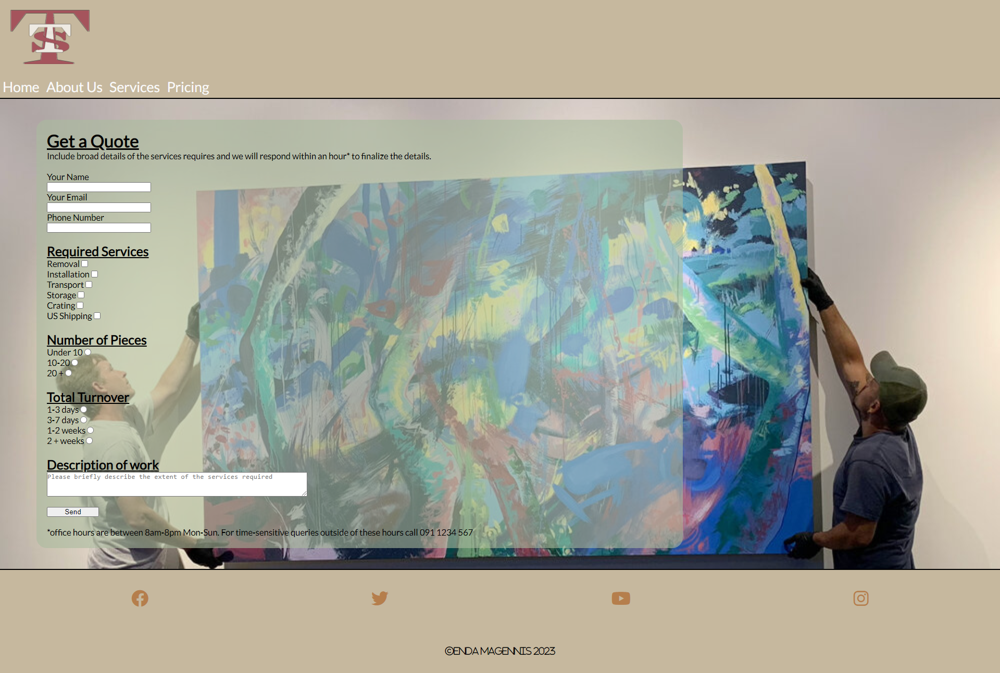

# Tuatha Transport Services

Tuatha Transport Services is a fictional art transportation company. The website allows the user to browse the available services and request a quote for selected services.

The site can be accessed [here](https://endamagennis.github.io/tuatha_transport/index.html)

---
## Background to Tuatha

The inspiration to create a website based on this industry comes from personal experience. My father founded and owned a leadiing art transportation company before retirement,
giving me a unique insight into the inner workings of such a company. Tuatha is a slightly more corporate, and expansive version of the former family business. As a Galway-based company,
the logo bares the Galway colours of maroon and white. The name Tuatha, which translates to 'tribe', is also a refernce to Galway being the 'City of Tribes'.

---
## User Stories

* As a user, I want a clean and clear interface to easily navigate through the site
* As a user, I want a site which is polished so that I can be confident in the company's level of competence
* As a user, I want to understand the services and tranportation options available to me so that I can make an informed decision whether to use this company
* As a user, I want to be assured of quality and experience so that I can be certain of the safety of my artworks
* As a user, I want to be able to select from a variety of services and get an estimate of the cost for the work
* As a user, I want to establish a line of contact with the company should I require more specific services

## Features

+ ### Navbar
    - At the top of each page

    - Contains a clickable logo 

    - Contains navigation links for Home, About Us, Services, and Pricing
    
    
    - Links have a hover effect
    
    
--- 
+ ### Home Page

    - Contains a hero image, welcome message and company motto
    
    - Link to pricing page
    
    - Blurb about the foundation of the company
    
    - Image highlighting the origins of the company
    
    - Blurb discussing how the company has grown

The goal is to incorporate the personal journey of the founder in order to highlight the personal touch each job is given.
    - 
    
--- 
+ ### About Us Page

    - Contains a hero image, Meet the team message and Howard Schultz Quote
    
    - Link to pricing page
    
    - Images of each team member and their positions in the company

The goal is to inject personality and a sense of connection to the company
    - 
    
---
+ ### Services Page
 
    - Maintains style consistencey with hero image, Services heading, and another company motto
    
    - Link to pricing page
    
    - Sections of headings, descriptions of services, cost considerations, and accompanying images

The goal is to give a clear and concise breakdown of the services provided and how costs are calculated
    - 
    
---
+ ### Pricing Page

    - Background image matching the homepage hero image for style consistency
    
    - Form used to get a quote via email:
        
        * Includes text input
        * Includes email input
        * Includes number input
        * Includes checkbox input
        * Includes radio input
        * Includes textarea
        * Includes submit input   

The goal is to alow the user to make tailored requests for jobs and recieve email feedback in a timely manner
    - 

--- 
+ ### Footer

    - Each page has a footer which contains social media links which open in a new tab
    - 

--- 
+ ### Thank you page

    - After form submission, the user is redirected to a thank you page
    - The page automatically returns the user to the homepage after 5 seconds

--- 
## Technologies Used

- [HTML](https://developer.mozilla.org/en-US/docs/Web/HTML) was the foundation of the site architecture.
- [CSS](https://developer.mozilla.org/en-US/docs/Web/css) was used for styling the HTML elements.
- [CSS Flexbox](https://developer.mozilla.org/en-US/docs/Learn/CSS/CSS_layout/Flexbox) was used for responsive design on each page.
- [CSS Grid](https://developer.mozilla.org/en-US/docs/Web/CSS/grid) was used partially for the services page layout.
- [Balsamiq](https://balsamiq.com/) was used to make wireframes for the website.
- [Codeanywhere](https://app.codeanywhere.com/) was used as the primary code editor.
- [Git](https://git-scm.com/) was used for the version control of the website.
- [GitHub](https://github.com/) was used to host the code and deploy the sight.
- [GIMP](https://www.gimp.org/) was used to create the logo for Tuatha.
- [COOLERS](https://coolors.co/) was used to generate color pallletes.
- [Stack Overflow](https://stackoverflow.com/) was used for some troubleshooting and implementation.
- [Pexels](https://www.pexels.com/) was used to source many of the images.
- [Google Images](https://www.google.com/imghp?hl=EN) was used to source some of the images.

--- 
## Design

### Colour Scheme

- Muted color pallette with soft pastels to create a visual sense of calm and composure, replicating an art gallery
- Allows the imagery and text to stand out

### Typogrphy

- Jost font from Goolge was the main font used throughout the site, it is a sans serif font with high readability with a touch of styling

- Lato was the original base font, but after testing, it became the fallback

- Merriweather is another Google API font, it is a high readablity serif font and was used to highlight workers names and positions

---
### Wireframes

#### Mobile devices

- [Home Page. Mobile Screen](documentation/wireframes/index_wireframe_350px.png)
- [About Us Page. Mobile Screen](documentation/wireframes/meet_the_team_wireframe_350px.png)
- [Services Page. Mobile Screen](documentation/wireframes/services_wireframe_350px.png)
- [Pricing Page. Mobile Screen](documentation/wireframes/get_a_quote_wireframe_350px.png)

#### Tablets

- [Home Page. Mobile Screen](documentation/wireframes/index_wireframe_900px.png)
- [About Us Page. Mobile Screen](documentation/wireframes/meet_the_team_wireframe_900px.png)
- [Services Page. Mobile Screen](documentation/wireframes/services_wireframe_900px.png)
- [Pricing Page. Mobile Screen](documentation/wireframes/get_a_quote_wireframe_900px.png)

#### Desktop

- [Home Page. Mobile Screen](documentation/wireframes/index_wireframe.png)
- [About Us Page. Mobile Screen](documentation/wireframes/meet_the_team_wireframe.png)
- [Services Page. Mobile Screen](documentation/wireframes/services_wireframe.png)
- [Pricing Page. Mobile Screen](documentation/wireframes/get_a_quote_wireframe.png)

--- 
## Testing

---
### Bugs

---
## Validator testing
+ ### HTML
  #### Home Page
       
  #### Gallery Page
    
  #### Contact Page
   
  #### Response Page
        
+ ### CSS
  
+ ### Accessibility and performance 

---
## Deployment
- This site was deployed using Github Pages
- A repository was created on Github from the [Code Institute Full Template](https://github.com/Code-Institute-Org/ci-full-template)
- The repository url was copied and input as a workspace in [Codeanywhere](https://app.codeanywhere.com/) 
- The HTML and CSS were edited in the workspace
- Using the built-in terminal, changes were git added, git committed, and git pushed to the main branch of the Github repository
- From the main branch of the [Github Repository](https://endamagennis.github.io/tuatha_transport/index.html), settings was selected
- From there I navigated to the Pages tab
- Under Build and Deployment, I navigated to Branch, selected main, selected root, and clicked save
- Github then built and deployed the site in a matter of minutes

---

## Future improvements
- add favicon with [Favicon Generator. For real.](https://realfavicongenerator.net/);
- add custom 404 page;
- add accessability report with [WAVE Web Accessibility Evaluation Tool](https://wave.webaim.org/);
- improve the quality of the commit messages (I am aware that some of them are not very clear and not meeting the standards and will improve them in the future);
- create a genuine estimate calculator which will use the inputs of the form to generate an actual quote and send the customer and email

---
## Credits

+ #### Content

    

+ #### Media

+ #### Tools

---

## Acknowledgments

- [Iuliia Konovalova](https://github.com/IuliiaKonovalova), my mentor who gave me excellent advice, tips, and resources throughout this project and has pushed me to improve.
- [Claire Heneghan](https://github.com/HeneghanC), my partner who gave feedback and advice on the website.
- [Alan Bushell](https://github.com/Alan-Bushell), my cohort co-ordinator who gave live feedback during a stand-up and has been helpful throughout the course.
- [Code Institute](https://codeinstitute.net/ie/), who have given me the tools and knowledge to persue my goal.

---

